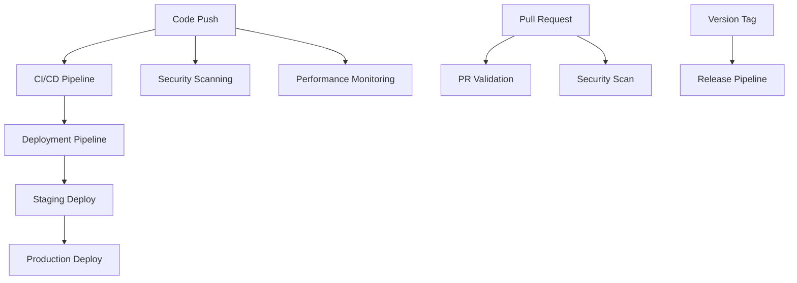

# 🚀 CI/CD Setup Guide

This guide will help you configure the comprehensive CI/CD pipeline for your Playwright-Cucumber testing framework.

## 📋 Prerequisites

- GitHub repository with admin access
- Node.js 18+ and npm
- Understanding of GitHub Actions
- Access to deployment environments (staging/production)

## 🔧 Initial Setup

### 1. Repository Secrets

Configure the following secrets in your GitHub repository:

```bash
# Go to Settings > Secrets and variables > Actions
```

#### Required Secrets:

- `GITHUB_TOKEN` - Automatically provided by GitHub
- `NPM_TOKEN` - For npm package publishing (if needed)

#### Optional Secrets:

- `SLACK_WEBHOOK_URL` - For Slack notifications
- `DISCORD_WEBHOOK_URL` - For Discord notifications
- `LHCI_GITHUB_APP_TOKEN` - For Lighthouse CI GitHub integration

#### Deployment Secrets:

- `STAGING_SSH_KEY` - SSH key for staging server
- `PRODUCTION_SSH_KEY` - SSH key for production server
- `AWS_ACCESS_KEY_ID` - For AWS deployments
- `AWS_SECRET_ACCESS_KEY` - For AWS deployments
- `DOCKER_HUB_USERNAME` - For Docker image publishing
- `DOCKER_HUB_ACCESS_TOKEN` - For Docker image publishing

### 2. Environment Configuration

Create environment protection rules:

#### Staging Environment:

1. Go to Settings > Environments
2. Click "New environment"
3. Name: `staging`
4. Configure deployment protection rules (optional)

#### Production Environment:

1. Go to Settings > Environments
2. Click "New environment"
3. Name: `production`
4. Enable "Required reviewers" (recommended)
5. Add trusted team members as reviewers
6. Set deployment branch rule to `main` only

### 3. Branch Protection Rules

Set up branch protection for `main` and `develop`:

```yaml
# Go to Settings > Branches > Add rule
Branch name pattern: main
Require a pull request before merging: ✓
Require status checks to pass before merging: ✓
Status checks found in the last week for this repository:
  - 🧪 Unit Tests
  - 🌐 API Tests
  - 🥒 BDD Smoke Tests
Require branches to be up to date before merging: ✓
Restrict pushes that create files larger than 100MB: ✓
```

## 🏗️ Workflow Architecture

### Core Workflows

1. **🚀 CI/CD Pipeline** (`ci.yml`)
   - Triggered on: push to main/develop, pull requests
   - Features: Full test suite, multi-browser testing, deployment

2. **🔍 Pull Request Validation** (`pull-request.yml`)
   - Triggered on: pull request events
   - Features: Fast feedback, essential tests only

3. **🚀 Release Pipeline** (`release.yml`)
   - Triggered on: version tags, manual dispatch
   - Features: Comprehensive testing, release artifacts

4. **🔒 Security Scanning** (`security.yml`)
   - Triggered on: push, pull requests, schedule
   - Features: CodeQL, dependency scanning, secret detection

5. **⚡ Performance Monitoring** (`performance.yml`)
   - Triggered on: push, pull requests, schedule
   - Features: Lighthouse CI, Web Vitals, load testing

6. **🚀 Deployment Pipeline** (`deployment.yml`)
   - Triggered on: successful CI completion
   - Features: Staging/production deployment with approval gates

### Workflow Dependencies



## 🎯 Best Practices Implemented

### Security

- ✅ CodeQL static analysis
- ✅ Dependency vulnerability scanning
- ✅ Secret detection with TruffleHog
- ✅ SAST scanning with Semgrep
- ✅ License compliance checking
- ✅ Minimal permissions principle

### Testing

- ✅ Multi-browser testing (Chromium, Firefox, WebKit)
- ✅ Parallel test execution
- ✅ Test result artifacts
- ✅ Flaky test detection
- ✅ Performance regression testing
- ✅ Accessibility compliance (WCAG)

### Deployment

- ✅ Blue/green deployment strategy
- ✅ Environment-specific configurations
- ✅ Rollback capabilities
- ✅ Health checks and smoke tests
- ✅ Manual approval gates for production
- ✅ Deployment notifications

### Performance

- ✅ Lighthouse CI integration
- ✅ Core Web Vitals monitoring
- ✅ Bundle size analysis
- ✅ Load testing capabilities
- ✅ Performance trend tracking

## 📊 Monitoring and Observability

### Metrics Tracked

- Test execution times
- Test success/failure rates
- Performance benchmarks
- Security vulnerability counts
- Deployment frequency
- Lead time for changes
- Mean time to recovery

### Dashboards

- GitHub Actions dashboard for workflow status
- Test results visualization
- Performance trends
- Security posture overview

## 🔧 Customization

### Adding New Test Types

1. Create test files with appropriate tags
2. Update workflow test strategies
3. Add new job in CI pipeline
4. Configure artifact collection

### Environment-Specific Configuration

```typescript
// src/config/environments.ts
export const environments = {
  staging: {
    baseURL: "https://staging.your-domain.com",
    timeout: 30000,
  },
  production: {
    baseURL: "https://your-domain.com",
    timeout: 15000,
  },
};
```

### Custom Notifications

```yaml
# Add to any workflow
- name: Custom notification
  if: failure()
  run: |
    curl -X POST "${{ secrets.WEBHOOK_URL }}" \
      -H "Content-Type: application/json" \
      -d '{"message": "Deployment failed for ${{ github.sha }}"}'
```

## 🚨 Troubleshooting

### Common Issues

1. **Tests failing in CI but passing locally**
   - Check environment variables
   - Verify browser versions
   - Review timing issues

2. **Deployment failures**
   - Check environment secrets
   - Verify deployment permissions
   - Review infrastructure status

3. **Security scan false positives**
   - Update scan configurations
   - Add ignore files for specific findings
   - Review and approve legitimate findings

### Debug Mode

Enable debug logging by setting:

```yaml
env:
  ACTIONS_STEP_DEBUG: true
  ACTIONS_RUNNER_DEBUG: true
```

## 📚 Additional Resources

- [GitHub Actions Documentation](https://docs.github.com/en/actions)
- [Playwright Documentation](https://playwright.dev/)
- [Cucumber.js Documentation](https://cucumber.io/docs/cucumber/)
- [Security Best Practices](https://docs.github.com/en/actions/security-guides)
- [Performance Testing Guide](https://web.dev/performance/)

## 🎯 Success Metrics

Track these KPIs to measure CI/CD effectiveness:

- **Deployment Frequency**: How often you deploy to production
- **Lead Time**: Time from commit to production deployment
- **Change Failure Rate**: Percentage of deployments causing issues
- **Mean Time to Recovery**: Time to recover from failures
- **Test Coverage**: Percentage of code covered by tests
- **Security Findings**: Number of critical/high vulnerabilities

## 🚀 Getting Started

1. Copy all workflow files to `.github/workflows/`
2. Configure repository secrets
3. Set up environment protection rules
4. Create your first pull request
5. Watch the magic happen! ✨

Your CI/CD pipeline is now ready to provide world-class automation for your Playwright-Cucumber testing framework!
