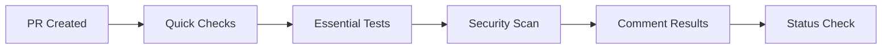
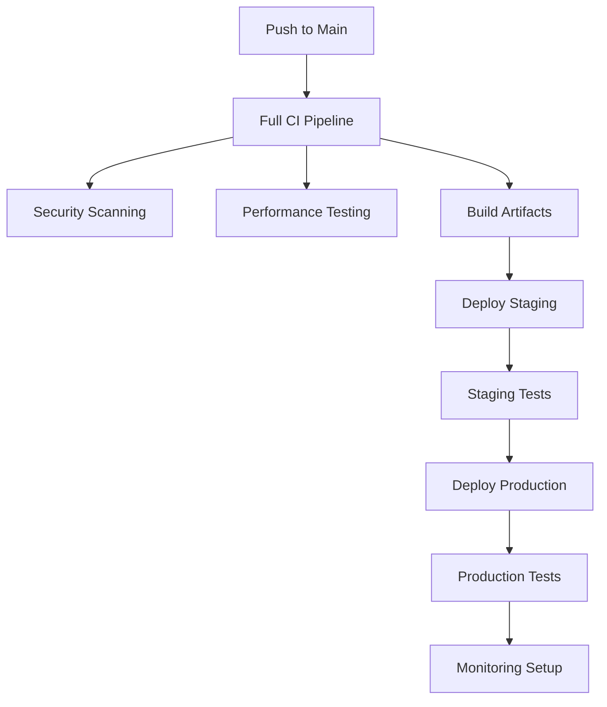
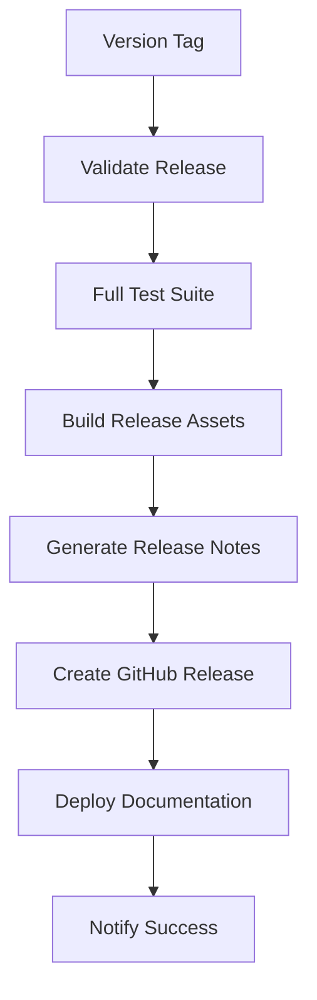

# 🎭 Playwright-Cucumber CI/CD Pipeline Documentation

## Workflow Overview

Your repository now includes a comprehensive CI/CD pipeline with **6 main workflows** and **best practices** for modern software development.

### Workflow Files Created

| File               | Purpose                | Triggers                  |
| ------------------ | ---------------------- | ------------------------- |
| `ci.yml`           | Main CI/CD Pipeline    | Push to main/develop, PRs |
| `pull-request.yml` | PR Validation          | Pull request events       |
| `release.yml`      | Release Management     | Version tags, manual      |
| `security.yml`     | Security Scanning      | Push, PRs, schedule       |
| `performance.yml`  | Performance Monitoring | Push, PRs, schedule       |
| `deployment.yml`   | Deployment Pipeline    | CI completion             |

## Key Features Implemented

### **Comprehensive Testing**

- **Multi-browser testing** (Chromium, Firefox, WebKit)
- **API endpoint validation** with automated data creation
- **Visual regression testing** with screenshot comparison
- **Accessibility compliance** (WCAG 2.1 AA standards)
- **BDD scenarios** with Cucumber integration
- **Performance benchmarking** with configurable thresholds

### 🔒 **Security First**

- **CodeQL static analysis** for vulnerability detection
- **Dependency scanning** with automated vulnerability alerts
- **Secret detection** using TruffleHog
- **SAST scanning** with Semgrep
- **License compliance** checking
- **Container security** (Dockerfile analysis when present)

### **Performance Monitoring**

- **Lighthouse CI** integration for web performance
- **Core Web Vitals** monitoring (LCP, CLS, FCP, TTFB)
- **Bundle size analysis** with optimization recommendations
- **Load testing** capabilities for stress testing
- **Performance trend tracking** for regression detection

### 🔄 **Smart Deployment**

- **Environment-specific deployments** (staging → production)
- **Manual approval gates** for production releases
- **Blue/green deployment strategy** support
- **Automated rollback** capabilities
- **Post-deployment health checks** and smoke tests
- **Deployment notifications** with status updates

### 📈 **Quality Gates**

- **Branch protection rules** enforcement
- **Required status checks** before merging
- **Automated dependency updates** via Dependabot
- **Code coverage reporting** and tracking
- **Flaky test detection** and reporting

## Workflow Strategy

### Pull Request Workflow



### Main Branch Workflow



### Release Workflow



## 📋 Configuration Requirements

### 1. **Repository Settings**

#### Branch Protection Rules

```yaml
Branch: main
 Require a pull request before merging
 Require status checks to pass before merging
Required checks:
  - 🧪 Unit Tests
  - 🌐 API Tests
  - 🥒 BDD Smoke Tests
 Require branches to be up to date before merging
 Restrict pushes that create files larger than 100MB
```

#### Environment Setup

```yaml
Environments:
  staging:
    - Deployment protection: None (auto-deploy)
    - Environment secrets: STAGING_*

  production:
    - Deployment protection: Required reviewers
    - Required reviewers: [@team-leads]
    - Environment secrets: PRODUCTION_*
```

### 2. **Repository Secrets**

#### Required Secrets

```bash
GITHUB_TOKEN          # Auto-provided by GitHub
NPM_TOKEN              # For package publishing (optional)
```

#### Notification Secrets (Optional)

```bash
SLACK_WEBHOOK_URL      # Slack notifications
DISCORD_WEBHOOK_URL    # Discord notifications
TEAMS_WEBHOOK_URL      # Microsoft Teams notifications
```

#### Deployment Secrets

```bash
AWS_ACCESS_KEY_ID      # AWS deployment credentials
AWS_SECRET_ACCESS_KEY  # AWS deployment credentials
DOCKER_HUB_USERNAME    # Docker registry access
DOCKER_HUB_ACCESS_TOKEN # Docker registry access
```

## Architecture Principles

### **Fail Fast Philosophy**

- Quick feedback loops with essential tests in PRs
- Comprehensive validation only on main branch
- Early detection of issues before production

### **Security by Design**

- Multiple security scanning layers
- Automated vulnerability detection
- Secret scanning and prevention
- License compliance monitoring

### **Performance First**

- Continuous performance monitoring
- Regression detection and alerts
- Budget-based performance gates
- Load testing integration

### **Deployment Safety**

- Environment progression (staging → production)
- Manual approval gates for critical environments
- Automated rollback capabilities
- Comprehensive post-deployment validation

## Metrics and Monitoring

### **DORA Metrics Tracking**

- **Deployment Frequency**: How often you deploy
- **Lead Time for Changes**: Commit to production time
- **Change Failure Rate**: Percentage of failed deployments
- **Mean Time to Recovery**: Time to fix production issues

### **Quality Metrics**

- **Test Coverage**: Code coverage percentage
- **Security Posture**: Vulnerability count and severity
- **Performance Trends**: Web Vitals progression
- **Dependency Health**: Outdated and vulnerable packages

### **Pipeline Metrics**

- **Build Success Rate**: CI/CD pipeline reliability
- **Test Execution Time**: Performance of test suites
- **Deployment Success Rate**: Deployment reliability
- **Time to Feedback**: PR validation speed

## Customization Guide

### **Adding New Test Types**

1. Create test files with appropriate `@tags`
2. Update workflow test matrices
3. Configure artifact collection
4. Add status checks to branch protection

### **Environment-Specific Configuration**

```typescript
// src/config/test-environments.ts
export const testConfig = {
  staging: {
    baseURL: process.env.STAGING_BASE_URL,
    timeout: 30000,
    retries: 2,
  },
  production: {
    baseURL: process.env.PRODUCTION_BASE_URL,
    timeout: 15000,
    retries: 1,
  },
};
```

### **Custom Notification Integration**

```yaml
- name: Custom notification
  if: failure()
  run: |
    curl -X POST "${{ secrets.WEBHOOK_URL }}" \
      -H "Content-Type: application/json" \
      -d '{
        "event": "deployment_failed",
        "commit": "${{ github.sha }}",
        "environment": "${{ env.ENVIRONMENT }}"
      }'
```

## 🚨 Troubleshooting

### **Common Issues & Solutions**

#### Tests Pass Locally But Fail in CI

```bash
# Check environment differences
- Verify Node.js version compatibility
- Check timezone settings
- Review browser versions
- Validate environment variables
```

#### Deployment Failures

```bash
# Debug deployment issues
- Verify environment secrets
- Check infrastructure status
- Review deployment logs
- Validate health check endpoints
```

#### Security Scan False Positives

```bash
# Handle security findings
- Review and dismiss legitimate findings
- Update security scan configurations
- Add ignore patterns for known safe code
- Document security exceptions
```

#### Performance Regression Detection

```bash
# Address performance issues
- Compare performance metrics trends
- Identify slow queries or operations
- Review bundle size changes
- Optimize critical rendering path
```

## Success Criteria

### **Pipeline Health Indicators**

- **>95% build success rate** across all workflows
- **<10 minute feedback time** for PR validation
- **Zero critical security vulnerabilities** in production
- **<5% deployment failure rate** with quick recovery
- **Automated dependency updates** with <1 week lag

### **Quality Benchmarks**

- **>80% test coverage** maintained consistently
- **All accessibility tests passing** (WCAG 2.1 AA)
- **Performance budgets met** (LCP <2.5s, CLS <0.1)
- **API response times <500ms** for critical endpoints
- **Visual regression tests** preventing UI breaks

## Best Practices Implemented

### **Code Quality**

- Automated linting and formatting
- TypeScript strict mode enforcement
- Comprehensive test coverage requirements
- Regular dependency updates

### **Security**

- Least privilege access principles
- Automated vulnerability scanning
- Secret detection and prevention
- Supply chain security monitoring

### **Performance**

- Continuous performance monitoring
- Performance budget enforcement
- Core Web Vitals tracking
- Load testing integration

### **Operations**

- Infrastructure as Code principles
- Automated deployment processes
- Comprehensive monitoring and alerting
- Disaster recovery procedures

## Getting Started

1. **Copy workflow files** to `.github/workflows/`
2. **Configure repository settings** (branch protection, environments)
3. **Set up required secrets** in repository settings
4. **Create your first PR** to see the pipeline in action
5. **Monitor workflow execution** and adjust as needed

Your CI/CD pipeline is now production-ready with enterprise-grade automation!

---

**Need help?** Check the troubleshooting section or create an issue in the repository.
